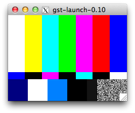
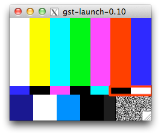

<!DOCTYPE html>
<html lang="en">
<head>
  <meta charset="utf-8" />
  <title>stb-tester: Getting started</title>
  <link href="stb-tester.css" media="all" rel="stylesheet" type="text/css" />

  

</head>

<body id="getting-started">

  <h1>stb-tester: Getting started</h1>
  

    By <a href="http://david.rothlis.net">David Röthlisberger</a>.
    Last updated @UPDATED@.
  

%(body)s

<!-- Begin reStructuredText content -->

The following instructions assume a basic knowledge of the Unix command line
and of your system's package manager, and that you have read `"Introducing
stb-tester"`_.

GStreamer primer
----------------

`stb-tester`_ is built on top of `GStreamer`_, a library of media-handling
components. So first of all install the **gstreamer** and
**gstreamer-plugins-base** packages. [#package-names]_
stb-tester requires GStreamer **0.10** — the newer 1.0 is not backwards
compatible. [#fedora18]_

Verify by running::

    gst-launch videotestsrc ! ximagesink

You should see an X window with the test pattern shown at right.

**gst-launch** takes a GStreamer *pipeline* — the "**!**" is the GStreamer
equivalent of the Unix pipe "**|**". The **videotestsrc** element generates a
video stream; **ximagesink** draws it on an X11 display. [#x11]_

If your system supports the XVideo standard, you can use the more efficient
**xvimagesink** instead. Or **autovideosink** (from the gstreamer-plugins-good
package) which selects the best sink available (in theory; on my OS X system it
doesn't work). Or **fakesink**, which is a null sink—but then you won't see
anything at all. Or **udpsink** to stream the video to a **udpsrc** on another
computer. Or **filesink** to save the data to disk.

GStreamer elements can be configured by setting their **properties**::

    gst-launch videotestsrc pattern=1 ! ximagesink

Use **gst-inspect** to list an element's properties::

    gst-inspect videotestsrc

To debug GStreamer pipelines you can tell ``gst-launch`` to print debug
messages for the entire pipeline or individual elements. See the
`gst-launch(1)`_ man page for details.

Install stb-tester from pre-built packages
------------------------------------------

stb-tester RPMs for Fedora 16 and 17 are hosted by the OpenSUSE Build Service
at http://download.opensuse.org/repositories/home:/stb-tester/

Register the repository with your package manager by downloading the file
``home:stb-tester.repo`` to ``/etc/yum.repos.d/`` [#stb-tester.repo]_ and then
``sudo yum install stb-tester``.

Install stb-tester from source
------------------------------

To build stb-tester you will need to install the following packages:
[#devel-package-names]_ **gstreamer-devel**, **gstreamer-plugins-base-devel**,
**gstreamer-python**, **opencv-devel**, and **python-docutils** (to build the
documentation). Then::

    git clone git://github.com/drothlis/stb-tester.git
    cd stb-tester
    make prefix=$HOME
    make prefix=$HOME install

This will install the ``stbt`` command-line program to ``$HOME/bin``, and the
``libgst-stb-tester.so`` GStreamer plugin to ``$HOME/.gstreamer-0.10/plugins``,
which is on GStreamer's search path.

To test that stb-tester's GStreamer plugin has been installed correctly::

    gst-launch videotestsrc \
        ! stbt-templatematch template=stb-tester/tests/videotestsrc-bw.png \
        ! ffmpegcolorspace ! ximagesink

You should see a red border around the area matched by the
**stbt-templatematch** element.

You can also run **make check** which will launch several pipelines like the
above and verify they work by listening for certain messages on the GStreamer
bus.

GStreamer primer: Caps
----------------------

Each GStreamer element supports one or more specific media formats on its
**source** (output) and **sink** (input) pads. GStreamer calls this the
element's **capabilities** or "**caps**".

**gst-inspect** will list an element's caps::

    gst-inspect stbt-templatematch

.. container:: figure

  ::

    Pad Templates:
      SINK template: 'sink'
        Availability: Always
        Capabilities:
          video/x-raw-rgb
                        bpp: 24
                      depth: 24
                 endianness: 4321
                   red_mask: 255
                 green_mask: 65280
                  blue_mask: 16711680
                      width: [ 1, 2147483647 ]
                     height: [ 1, 2147483647 ]
                  framerate: [ 0/1, 2147483647/1 ]
      SRC template: 'src'
        Availability: Always
        Capabilities:
          video/x-raw-rgb
                        bpp: 24
                      depth: 24
                 endianness: 4321
                   red_mask: 255
                 green_mask: 65280
                  blue_mask: 16711680
                      width: [ 1, 2147483647 ]
                     height: [ 1, 2147483647 ]
                  framerate: [ 0/1, 2147483647/1 ]</code>

  stbt-templatematch caps

stbt-templatematch's **sink** pad only accepts one format, **video/x-raw-rgb**
with specific red, green and blue masks that correspond to BGR channel order.
(In other words, RGB and BGR are both called "video/x-raw-rgb" but with
different channel masks.)

videotestsrc's **source** pad can emit many different formats, including the
BGR expected by stbt-templatematch, so these two elements can be connected
together. When the pipeline starts they will negotiate the best format to use.

ximagesink, however, does not accept BGR on its source pad, so we inserted the
**ffmpegcolorspace** element to convert each video frame to a format understood
by ximagesink. Have a look at ffmpegcolorspace's caps with ``gst-inspect``.

stbt record
-----------

Now let's run stb-tester itself. The command line tool is **stbt**::

    stbt record \
        --source-pipeline=videotestsrc \
        --sink-pipeline='ximagesink sync=false' \
        --control-recorder=file:///dev/stdin \
        --control=test

**stbt record** will start recording a test script that can be run later with
**stbt run**.

**source-pipeline** is a GStreamer pipeline that outputs video from the system
under test. For this tutorial we're using videotestsrc, but in practice you
would use something like v4l2src (followed by a demuxer and decoder if needed;
source-pipeline should output raw video in a format understood by
ffmpegcolorspace).

**sink-pipeline** is the familiar sink to display video on screen. In an
automated test rig running ``stbt`` continuously, you might set sink-pipeline
to a fakesink, or a filesink (to log a video of the test run), or a tee to an
ximagesink (for monitoring) *and* to a filesink.

``stbt record`` will listen for remote-control keypresses on the
**control-recorder** and will forward those keypresses to the system under test
using the **control**.

In real use you will probably want the **lirc** control-recorder, which will
use a USB infrared receiver (see `below <#using-a-real-control>`_ for details).
Here we use standard input, so we will just type key names (in the format
expected by the **control**) into the terminal.

**control** will also usually be a lirc infrared emitter, but here we're using
a special **test** control that will change the videotestsrc's pattern
property.

Now type ``15`` into the terminal (and press return) and notice that the video
pattern has changed. Now type ``10``, and ``1``, and finish with Control-D or
Control-C.

The test script
---------------

``stbt record`` has created **test.py** and three png **screenshots**. Use an
image editor to crop the first two screenshots to what you want your test
script to match. When capturing from a real set-top box, this is most likely to
be a GUI element like a button or a logo.

The third screenshot (if you typed ``1`` into standard input as per the
instructions in the previous section) will be random noise so whatever area you
crop is unlikely to be found as an exact match when you re-run the test case;
delete this screenshot.

Edit the test script to::

    press('15')
    wait_for_match('0000-15-complete.png')
    press('10')
    wait_for_match('0001-10-complete.png')
    press('1')
    wait_for_motion()

**press** takes a string that must be understood by the control you specify on
the ``stbt`` command line.

**wait_for_match** looks for the specified image in the source video stream.
The image can be specified as an absolute path, or a relative path from the
location of the test script. It will raise a MatchTimeout if no match is found.

**wait_for_motion** looks for changes in consecutive frames of the source video
stream. It will raise a MotionTimeout if no motion is detected.

See `"Test script format" in the stbt(1) man page`_ for details.

Note that if you want your test script to be the slightest bit maintainable,
you should rename the screenshots to something that reflects their content.

stbt run
--------

Now use **stbt run** to run the test script we just recorded::

    stbt run \
        --source-pipeline=videotestsrc \
        --sink-pipeline='ximagesink sync=false' \
        --control=test \
        test.py

Check ``stbt``'s exit status (``echo $?``) for success or failure.

Config files
------------

To save typing out the same ``--source-pipeline``, ``--sink-pipeline``,
``--control`` and ``--control-recorder`` options over and over on the
``stbt`` command line, you can create a config file with default values.
See `"Configuration" in the stbt(1) man page`_ for details.

Check the default values reported by ``stbt run --help`` to confirm that your
config file is being read.

Using a real video source
-------------------------

Using video from a real set-top box is simply a matter of replacing ``stbt``'s
**source-pipeline** argument. The difficult part is finding a video capture
device with good quality, well supported drivers.

We use the `Hauppauge HD PVR`_, which takes HD component video up to 1080i,
with the following ``source-pipeline``::

    v4l2src device=/dev/video0 ! mpegtsdemux ! video/x-h264 ! decodebin2

**v4l2src** is a source element that should work with any device with
Video-for-Linux drivers. The Hauppauge HD PVR has an `open-source driver`_
already present in recent versions of the Linux kernel.

The HD PVR produces MPEG-TS containing H.264, hence the remainder of the
pipeline. The ``video/x-h264`` caps is there to throw away the audio component
of the stream (without it, decodebin2 would still figure out that the stream is
in H.264 format by negotiating with the mpegtsdemux element). stb-tester
doesn't currently support audio, but it is on the roadmap.

Note that mpegtsdemux is from the **gstreamer-plugins-bad** package, and
decodebin2 requires the **gstreamer-ffmpeg** package [#fn-rpmfusion]_ in order
to decode H.264.

Make sure you get your own video capture pipeline working with ``gst-launch``
before attempting to use it with ``stbt``.

Using a real control
--------------------

To control the set-top box under test via infra-red signals, you will need a
USB infra-red emitter supported by `LIRC`_, such as the `RedRat3`_.

Install the **lirc** package, start the **lircd** daemon, record a
**lircd.conf** config file for your particular remote control with `irrecord`_
(you will need an infra-red receiver; the RedRat3 is both emitter and
receiver), and test the emitter with `irsend`_.

Then set ``stbt``'s ``--control`` to **lirc::control_name**, where
*control_name* is the name specified in your ``lircd.conf``.

``--control-recorder`` (used for recording test cases with ``stbt
record``) also takes a similar lirc configuration string. (See
`"Options" in the stbt(1) man page`_ for details.)

For non infra-red control methods, add your own receiver and emitter
code to stb-tester. Currently you'd have to edit ``stbt.py`` directly,
but contact us first and we'll work out some kind of pluggable API.

Get in touch
------------

If you have found stb-tester useful, or just intriguing, or you have any
questions, let us know! You'll find us on the `mailing list`_.

.. container:: footnotes

  .. [#package-names]
     RedHat-based Linux distributions (RHEL, Fedora):
       sudo yum install **gstreamer gstreamer-plugins-base**
     Debian-based Linux distributions (Ubuntu):
       sudo apt-get install **gstreamer0.10-tools gstreamer0.10-plugins-base**
     OS X (use `macports`_ or `homebrew`_):
       sudo port install **gstreamer gst-plugins-base**

  .. [#fedora18] On Fedora 18, for example, GStreamer 0.10 packages are called
     "gstreamer", "gstreamer-plugins-base", etc., while GStreamer 1.0 packages
     are "gstreamer1", "gstreamer1-plugins-base", etc.

  .. [#x11] If your OS X system doesn't have X11 install `XQuartz`_, or use
     glimagesink (from the gst-plugins-gl macports package) instead of
     ximagesink.

  .. [#stb-tester.repo] For example,
     for Fedora 17::

         sudo wget -O /etc/yum.repos.d/stb-tester.repo \
         http://download.opensuse.org/repositories/home:/\
         stb-tester/Fedora_17/home:stb-tester.repo

  .. [#devel-package-names]
     RedHat-based Linux distributions (RHEL, Fedora):
       **gstreamer-devel gstreamer-plugins-base-devel
       gstreamer-python opencv-devel python-docutils**
     Debian-based Linux distributions (Ubuntu):
       **libgstreamer0.10-dev libgstreamer-plugins-base0.10-dev
       python-gst0.10 libopencv-dev python-docutils**
     OS X with `macports`_:
       **py27-gst-python opencv py27-docutils**
     OS X with `homebrew`_:
       Install **gst-python** and **opencv** via homebrew, and **docutils**
       via your `python package manager`_.

  .. [#fn-rpmfusion] On Fedora and RHEL you can get the gstreamer-plugins-bad
     and gstreamer-ffmpeg packages from `rpmfusion`_.

.. _"Introducing stb-tester": introduction.html
.. _stb-tester: http://stb-tester.com
.. _GStreamer: http://gstreamer.freedesktop.org
.. _macports: http://www.macports.org/install.php
.. _homebrew: http://mxcl.github.com/homebrew/
.. _gst-launch(1): http://linux.die.net/man/1/gst-launch-0.10
.. _"Test script format" in the stbt(1) man page: stbt.html#test-script-format
.. _"Configuration" in the stbt(1) man page: stbt.html#configuration
.. _"Options" in the stbt(1) man page: stbt.html#options
.. _Hauppauge HD PVR: http://www.hauppauge.com/site/products/data_hdpvr.html
.. _open-source driver: http://git.kernel.org/?p=linux/kernel/git/stable/linux-stable.git;a=tree;f=drivers/media/video/hdpvr
.. _LIRC: http://www.lirc.org
.. _RedRat3: http://www.redrat.co.uk/products/index.html
.. _irrecord: http://www.lirc.org/html/irrecord.html
.. _irsend: http://www.lirc.org/html/irsend.html
.. _mailing list: http://groups.google.com/group/stb-tester
.. _XQuartz: http://xquartz.macosforge.org
.. _python package manager: http://pypi.python.org/pypi/pip/
.. _rpmfusion: http://rpmfusion.org

<!-- End reStructuredText content -->

  This article copyright © 2012-2013 <a href="http://david.rothlis.net">David
  Röthlisberger</a>. 
  Licensed under a <a rel="license"
  href="http://creativecommons.org/licenses/by-sa/3.0/">Creative Commons
  Attribution-ShareAlike 3.0 Unported license</a>.

</body>
</html>
