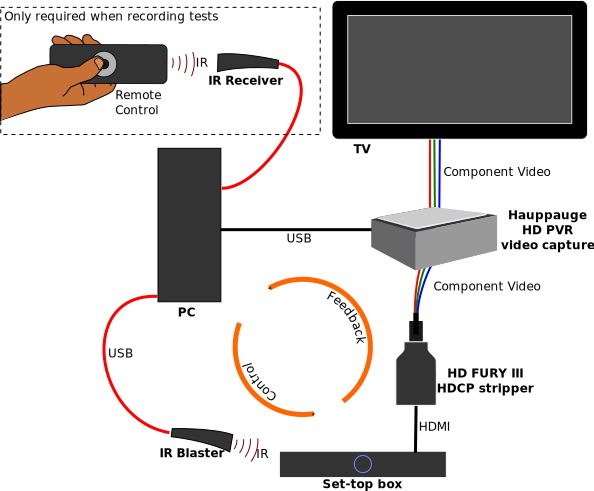

<!DOCTYPE html>
<html lang="en">
<head>
  <meta charset="utf-8" />
  <title>stb-tester: Getting started</title>
  <link href="stb-tester.css" media="all" rel="stylesheet" type="text/css" />

  

</head>

<body id="getting-started">

  <h1>stb-tester: Getting started</h1>
  

    By <a href="http://david.rothlis.net">David Röthlisberger</a>.
    Last updated @UPDATED@.
  

  <a href="http://stb-tester.com" id="back">[Back to stb-tester.com]</a>

%(body)s

<!-- Begin reStructuredText content -->

The following instructions assume a basic knowledge of the Unix command line
and of your system's package manager, and that you have read `"Introducing
stb-tester"`_.

GStreamer primer
----------------

`stb-tester`_ is built on top of `GStreamer`_, a library of media-handling
components. So first of all install the **gstreamer** and
**gstreamer-plugins-base** packages. [#gst-package-names]_
stb-tester requires GStreamer **0.10** — the newer 1.0 is not backwards
compatible. [#fedora18]_

Verify by running::

    gst-launch videotestsrc ! ximagesink

You should see an X window with the test pattern shown at right.

**gst-launch** takes a GStreamer *pipeline* — the "**!**" is the GStreamer
equivalent of the Unix pipe "**|**". The **videotestsrc** element generates a
video stream; **ximagesink** draws it on an X11 display. [#x11]_

If your system supports the XVideo standard, you can use the more efficient
**xvimagesink** instead. Or **autovideosink** (from the gstreamer-plugins-good
package) which selects the best sink available (in theory; on my OS X system it
doesn't work). Or **fakesink**, which is a null sink—but then you won't see
anything at all. Or **udpsink** to stream the video to a **udpsrc** on another
computer. Or **filesink** to save the data to disk.

GStreamer elements can be configured by setting their **properties**::

    gst-launch videotestsrc pattern=snow ! ximagesink

Use **gst-inspect** to list an element's properties::

    gst-inspect videotestsrc

To debug GStreamer pipelines you can tell ``gst-launch`` to print debug
messages for the entire pipeline or individual elements. See the
`gst-launch(1)`_ man page for details.

Install stb-tester from pre-built packages
------------------------------------------

stb-tester RPMs for Fedora 17, 18 and 19 are hosted by the OpenSUSE Build Service.
Follow the `installation instructions
<http://software.opensuse.org/download.html?project=home%3Astb-tester&package=stb-tester>`_.

Install stb-tester from source
------------------------------

To build and run stb-tester you will need to install the following packages:
[#package-names]_ **gstreamer**, **gstreamer-plugins-base**,
**gstreamer-plugins-good**, **gstreamer-plugins-bad-free**,
**gstreamer-python**, **opencv**, **opencv-python**;
**python-docutils** (to build the documentation),
and **python-nose**, **python-pep8**, and **pylint** (to run
the unit tests). Then::

    git clone git://github.com/drothlis/stb-tester.git
    cd stb-tester
    make prefix=$HOME
    make prefix=$HOME install

This will install the ``stbt`` command-line program to ``$HOME/bin``;
add ``$HOME/bin`` to your command search path (the ``PATH`` environment variable)
or invoke ``stbt`` as ``$HOME/bin/stbt``.

You can also run **make check** which will run several test scripts against the
videotestsrc GStreamer element you saw earlier. In many of these tests you will
see a red border drawn when stb-tester finds a match.

stbt record
-----------

Now let's run stb-tester itself. The command line tool is **stbt**::

    stbt record \
        --source-pipeline=videotestsrc \
        --sink-pipeline='ximagesink sync=false' \
        --control-recorder=file:///dev/stdin \
        --control=test

**stbt record** will start recording a test script that can be run later with
**stbt run**.

**source-pipeline** is a GStreamer pipeline that outputs video from the system
under test. For this tutorial we're using videotestsrc, but in practice you
would use something like v4l2src (followed by a demuxer and decoder if needed;
source-pipeline should output raw video in a format understood by
ffmpegcolorspace).

**sink-pipeline** is the familiar sink to display video on screen. In an
automated test rig running ``stbt`` continuously, you might set sink-pipeline
to a fakesink, or a filesink (to log a video of the test run), or a tee to an
ximagesink (for monitoring) *and* to a filesink.

``stbt record`` will listen for remote-control keypresses on the
**control-recorder** and will forward those keypresses to the system under test
using the **control**.

In real use you will probably want the **lirc** control-recorder, which will
use a USB infrared receiver (see `below <#using-a-real-control>`_ for details).
Here we use standard input, so we will just type key names (in the format
expected by the **control**) into the terminal.

**control** will also usually be a lirc infrared emitter, but here we're using
a special **test** control that will change the videotestsrc's pattern
property.

Now type ``gamut`` into the terminal (and press return) and notice that the
video pattern has changed. Now type ``checkers-8``, and ``snow``, and finish
with Control-D or Control-C.

The test script
---------------

``stbt record`` has created **test.py** and three png **screenshots**. Use an
image editor to crop the first two screenshots to what you want your test
script to match. When capturing from a real set-top box, this is most likely to
be a GUI element like a button or a logo.

The third screenshot (if you typed ``snow`` into standard input as per the
instructions in the previous section) will be random noise so whatever area you
crop is unlikely to be found as an exact match when you re-run the test case;
delete this screenshot.

Edit the test script to::

    press('gamut')
    wait_for_match('0000-gamut-complete.png')
    press('checkers-8')
    wait_for_match('0001-checkers-8-complete.png')
    press('snow')
    wait_for_motion()

**press** takes a string that must be understood by the control you specify on
the ``stbt`` command line.

**wait_for_match** looks for the specified image in the source video stream.
The image can be specified as an absolute path, or a relative path from the
location of the test script. It will raise a MatchTimeout if no match is found.

**wait_for_motion** looks for changes in consecutive frames of the source video
stream. It will raise a MotionTimeout if no motion is detected.

See `"Test script format" in the stbt(1) man page`_ for details.

Note that if you want your test script to be the slightest bit maintainable,
you should rename the screenshots to something that reflects their content.

stbt run
--------

Now use **stbt run** to run the test script we just recorded::

    stbt run \
        --source-pipeline=videotestsrc \
        --sink-pipeline='ximagesink sync=false' \
        --control=test \
        test.py

Check ``stbt``'s exit status (``echo $?``) for success or failure.

Config files
------------

To save typing out the same ``--source-pipeline``, ``--sink-pipeline``,
``--control`` and ``--control-recorder`` options over and over on the
``stbt`` command line, you can create a config file with default values.
See `"Configuration" in the stbt(1) man page`_ for details.

Check the default values reported by ``stbt run --help`` to confirm that your
config file is being read.

Using a real video source
-------------------------

Using video from a real set-top box is simply a matter of replacing ``stbt``'s
**source-pipeline** argument. The difficult part is finding a video capture
device with good quality, well supported drivers.

We use the `Hauppauge HD PVR`_, which takes HD component video up to 1080i,
with the following ``source-pipeline``::

    v4l2src device=/dev/video0 ! mpegtsdemux ! video/x-h264 ! decodebin2

**v4l2src** is a source element that should work with any device with
Video-for-Linux drivers. The Hauppauge HD PVR has an `open-source driver`_
already present in recent versions of the Linux kernel.

The HD PVR produces MPEG-TS containing H.264, hence the remainder of the
pipeline. The ``video/x-h264`` capabilities (or "caps") [#caps]_
is there to throw away the audio component
of the stream (without it, decodebin2 would still figure out that the stream is
in H.264 format by negotiating with the mpegtsdemux element). stb-tester
doesn't currently support audio, but it is on the roadmap.

Note that mpegtsdemux is from the **gstreamer-plugins-bad** package, and
decodebin2 requires the **gstreamer-ffmpeg** package [#fn-rpmfusion]_ in order
to decode H.264.

Make sure you get your own video capture pipeline working with ``gst-launch``
before attempting to use it with ``stbt``.

Using a real control
--------------------

To control the set-top box under test via infra-red signals, you will need a
USB infra-red emitter supported by `LIRC`_, such as the `RedRat3`_.

Install the **lirc** package, start the **lircd** daemon, and record a
**lircd.conf** config file for your particular remote control with `irrecord`_
(you will need an infra-red receiver; the RedRat3 is both emitter and
receiver). Test the emitter with `irsend`_, and the receiver with `irw`_.

Then set ``stbt``'s ``--control`` to **lirc::control_name**, where
*control_name* is the name specified in your ``lircd.conf``.

``--control-recorder`` (used for recording test cases with ``stbt
record``) takes a similar configuration string. (See
`"Options" in the stbt(1) man page`_ for details.)

``stbt`` also supports the RedRat `irNetBox`_, a network-controlled infrared
emitter (again, see the documentation for ``--control``).

For non infra-red control methods, add your own receiver and emitter
code to stb-tester. Currently you'd have to edit ``stbt.py`` directly,
but contact us first and we'll work out some kind of pluggable API.

stbt screenshot
---------------

Once you start writing more complex scripts and reusing elements from previous
scripts, you might find that ``stbt record`` is too tedious. We often prefer to
write the test scripts manually, and capture screenshots using ``stbt
screenshot``. See ``stbt screenshot --help`` for details, and see ``stbt
--help`` for additional ``stbt`` sub-commands.

Wiring diagram
--------------

The following diagram shows a setup that uses the Hauppauge HD PVR for video
capture, a USB infrared emitter for controlling the system under test, and
a USB infrared receiver for recording tests.

Get in touch
------------

If you have found stb-tester useful, or just intriguing, or you have any
questions, let us know! You'll find us on the `mailing list`_.

.. container:: footnotes

  .. [#gst-package-names]
     RedHat-based Linux distributions (RHEL, Fedora):
       sudo yum install **gstreamer gstreamer-plugins-base**
     Debian-based Linux distributions (Ubuntu):
       sudo apt-get install **gstreamer0.10-tools gstreamer0.10-plugins-base**
     OS X (use `macports`_ or `homebrew`_):
       sudo port install **gstreamer010 gstreamer010-gst-plugins-base**

  .. [#fedora18] On Fedora 18, for example, GStreamer 0.10 packages are called
     "gstreamer", "gstreamer-plugins-base", etc., while GStreamer 1.0 packages
     are "gstreamer1", "gstreamer1-plugins-base", etc.

  .. [#x11] If your OS X system doesn't have X11 install `XQuartz`_, or use
     glimagesink (from the gst-plugins-gl macports package) instead of
     ximagesink.

  .. [#package-names]
     RedHat-based Linux distributions (RHEL, Fedora):
       **gstreamer gstreamer-plugins-base
       gstreamer-plugins-good gstreamer-plugins-bad-free
       gstreamer-python opencv opencv-python
       python-docutils python-nose python-pep8 pylint**
     Debian-based Linux distributions (Ubuntu):
       **gstreamer0.10-tools gstreamer0.10-plugins-base
       gstreamer0.10-plugins-good gstreamer0.10-plugins-bad
       python-gst0.10 python-opencv python-numpy
       python-docutils python-nose pep8 pylint**
     OS X with `macports`_:
       **gstreamer010 gstreamer010-gst-plugins-base
       gstreamer010-gst-plugins-good gstreamer010-gst-plugins-bad
       py27-gst-python opencv +python27
       py27-docutils py27-nose py27-pep8 py27-pylint**
     OS X with `homebrew`_:
       Homebrew no longer has packages for GStreamer 0.10.

  .. [#caps] See `"Media Formats and Pad Capabilities"
     <http://docs.gstreamer.com/display/GstSDK/Basic+tutorial+6%3A+Media+formats+and+Pad+Capabilities>`_
     in the GStreamer SDK tutorial.

  .. [#fn-rpmfusion] On Fedora and RHEL you can get the gstreamer-plugins-bad
     and gstreamer-ffmpeg packages from `rpmfusion`_.

.. _"Introducing stb-tester": introduction.html
.. _stb-tester: http://stb-tester.com
.. _GStreamer: http://gstreamer.freedesktop.org
.. _macports: http://www.macports.org/install.php
.. _homebrew: http://mxcl.github.com/homebrew/
.. _gst-launch(1): http://linux.die.net/man/1/gst-launch-0.10
.. _"Test script format" in the stbt(1) man page: stbt.html#test-script-format
.. _"Configuration" in the stbt(1) man page: stbt.html#configuration
.. _"Options" in the stbt(1) man page: stbt.html#options
.. _irNetBox: http://www.redrat.co.uk/products/irnetbox.html
.. _Hauppauge HD PVR: http://www.hauppauge.com/site/products/data_hdpvr.html
.. _open-source driver: http://git.kernel.org/?p=linux/kernel/git/stable/linux-stable.git;a=tree;f=drivers/media/video/hdpvr
.. _LIRC: http://www.lirc.org
.. _RedRat3: http://www.redrat.co.uk/products/index.html
.. _irrecord: http://www.lirc.org/html/irrecord.html
.. _irsend: http://www.lirc.org/html/irsend.html
.. _irw: http://www.lirc.org/html/irw.html
.. _mailing list: http://groups.google.com/group/stb-tester
.. _XQuartz: http://xquartz.macosforge.org
.. _rpmfusion: http://rpmfusion.org

<!-- End reStructuredText content -->

  This article copyright © 2012-2013 <a href="http://david.rothlis.net">David
  Röthlisberger</a>. 
  Licensed under a <a rel="license"
  href="http://creativecommons.org/licenses/by-sa/3.0/">Creative Commons
  Attribution-ShareAlike 3.0 Unported license</a>.

</body>
</html>
