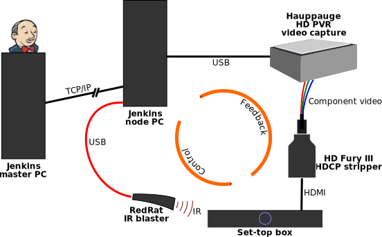

<!DOCTYPE html>
<html lang="en">
<head>
  <meta charset="utf-8" />
  <title>Using Jenkins to schedule &amp; report stb-tester scripts</title>
  <link href="stb-tester.css" media="all" rel="stylesheet" type="text/css" />

  

</head>

<!-- Copyright 2012 David Röthlisberger <david@rothlis.net>. All rights reserved. -->

<body id="jenkins">

  <h1>Using Jenkins to schedule &amp; report stb-tester scripts</h1>
  

    By <a href="http://david.rothlis.net">David Röthlisberger</a>.
    Last updated @UPDATED@.
  

%(body)s

<!-- Begin reStructuredText content -->

`stb-tester`_ is an open-source command-line tool that runs automated tests
against a set-top box or similar device by capturing and analysing its video
output. `Jenkins`_ is an open-source "continuous integration" tool with a web
interface. Jenkins is typically used to run software compilation jobs and
associated unit tests, but here we will use it to run stb-tester test scripts
and report on the results.

This article illustrates how easy it is to integrate stb-tester with an
external scheduling & reporting system. Using Jenkins in this way will give you
a very useful, working solution in only a couple of hours; eventually you may
want more control over the test scheduling, or more customised reports, which
would require building your own system (perhaps as a Jenkins plugin, perhaps a
separate system).

System overview
---------------

The Jenkins server runs on the **master** PC, which is attached to one or more
Jenkins **nodes** or slaves. Each node is attached to one set-top box (the
**system under test**) via an infra-red emitter and a video-capture device. A
single PC can host multiple Jenkins nodes (we are currently running 4 nodes,
i.e. 4 video-capture devices + 4 set-top boxes, per PC).

Via the web interface you create a Jenkins **job** to run one or more
stb-tester scripts. The job can be configured to run on a specific node, or on
any available node that has been tagged with a particular label. The job can be
configured to run once (to be scheduled manually with a single click from the
Jenkins home page), or continuously.

The Jenkins master instructs the node to run the job; the node checks out the
source code repository containing the stb-tester scripts, runs the scripts with
`stbt run`, and writes the results into an xml file. The master then retrieves
the xml results and other artifacts of the test run from the node.

.. container:: figure

  .. image:: jenkins+jobs.png

  Jenkins jobs

.. TODO: add green balls to screenshot ^^

Typically you would have several jobs running the same test (or set of tests)
against different software versions of the system under test (the current
production and development versions, at minimum). A "sanity pack" job might run
a small selection of your test scripts, and another "soak test" job might run
the same tests, plus others, over and over.

Node **labels** allow you to say things like "run this job on any node
connected to a set-top box with software version x.y" or, for tests that
require a specific broadcast input signal, "on any node connected to a set-top
box with software version x.y *and* connected to a modulator" (modulators are
expensive! And not every test requires one).

.. TODO: 2 screenshots: The graph of tests, and the table. vv

Jenkins displays **test results** for each run, and allows drilling down into
failing tests to view logs from standard output and standard error.

.. TODO: screenshot of links to download artifacts. vv

In addition to the above logs, Jenkins gathers any **build artifacts**
generated by the test run, as specified in the job configuration. These can
include custom logs, and screenshots and/or videos of the test run.

Detailed instructions
---------------------

I haven't finished writing the detailed instructions to configure the setup
described above; in the meantime, see the example script `jenkins-stbt-run`_ to
be run on the Jenkins node, and the configuration instructions in `this commit
message <https://github.com/drothlis/stb-tester/commit/d5e7983>`_.

.. _stb-tester: http://stb-tester.com
.. _Jenkins: http://jenkins-ci.org
.. _jenkins-stbt-run: https://github.com/drothlis/stb-tester/blob/master/extra/jenkins-stbt-run

<!-- End reStructuredText content -->

  This article copyright © 2012 <a href="http://david.rothlis.net">David
  Röthlisberger</a>. Diagram by Will Manley. 
  Released under the <a href="http://www.gnu.org/copyleft/fdl.html">GNU Free
  Documentation License</a>.

</body>
</html>
