<!DOCTYPE html>
<html lang="en">
<head>
  <meta charset="utf-8" />
  <title>stb-tester image matching parameters</title>
  <link href="stb-tester.css" media="all" rel="stylesheet" type="text/css" />

  

</head>

<body id="templatematch">

  <h1>stb-tester image matching parameters</h1>
  

    By <a href="http://lewishaley.co.uk">Lewis Haley</a>.
    Last updated @UPDATED@.
  

  <a href="http://stb-tester.com" id="back">[Back to stb-tester.com]</a>

%(body)s

<!-- Begin reStructuredText content -->

Since stb-tester 0.13, the **stbt-templatematch** gstreamer element and the
python function **detect_match** and its descendants (**wait_for_match** and
**press_until_match**) have been upgraded to allow much greater
customisation to the end user. Each available parameter will uniquely affect the
result of an attempted match, and here we will attempt to verbally and visually
demonstrate the available parameters. For clarity I will refer to the parameters
by their Python API name; for the parameters to the Gstreamer element see either::

    gst-inspect stbt-templatematch

or use the rule that (PY) `parameter_name` becomes (GST) `parameterName`.

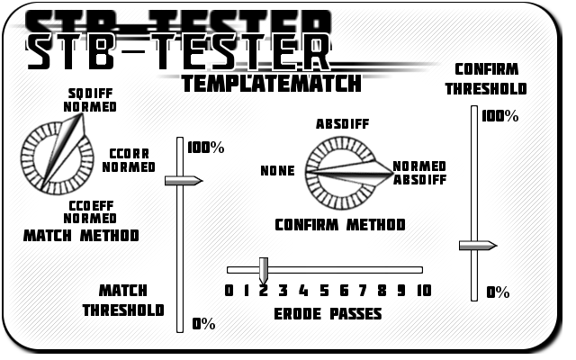

Template Matching Overview
==========================

Firstly, lets outline the process of how stb-tester looks for and finds a match.
**Stb-tester** utilises `OpenCV image processing`_ functions; the most key of
which is the `matchTemplate`_ function, which creates a "heat map" from numerous
comparisons of the template to the source image. The heat map consists of
floating point values, interpreted as grayscale pixels. The magnitude of a
pixel's value gives the indicative strength of match of the template at that
pixel's Cartesian coordinates (i.e. (x, y)) on the source frame. From this heat
map, we can assess the potential of whether the template can be found in the
source image, and if that results in a high chance of finding the match we
proceed onto the next step where we confirm whether the template is where we
think it is.

We call the process of making the heat map and determining the likelihood
of finding a match the "first pass", and confirming whether we have a match the
"second pass". Most of the sub-processes of which the two passes comprise
produce an intermediate image. These images are not saved to disk usually,
however they can be kept by setting the ``debugDirectory`` parameter when using
the Gstreamer element, or passing two ``-v`` `(verbose) flags`_ to ``stbt run``,
in which case the directory is automatically called **stbt-debug**. Note that if
an existing debug directory is present, it is not deleted and a new one created,
but rather any existing images are overwritten. This can mean that, for example,
you can run a test using "absdiff-normed" confirm method, which creates the
**stbt-debug** directory, then change it to use ``"absdiff"`` confirm method, which
overwrites all the images in **stbt-debug** *except* the ``*_gray_normalized.png``
images, which will still be present in the directory from the first test even
after the second one finishes. This is also true of subsequent matches in the
same test which use different confirm methods.

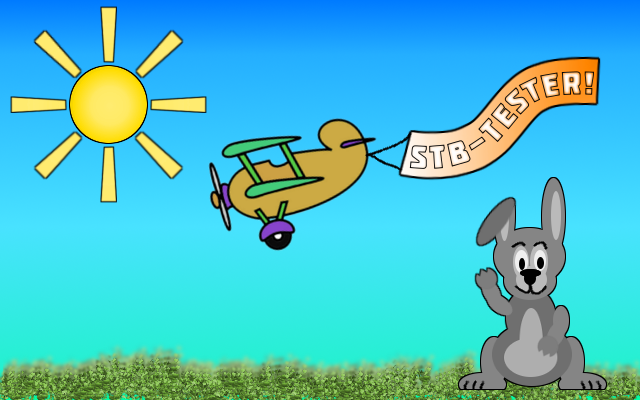

    To demonstrate the effect of the various parameters, we shall use the
    following image as a source frame.

.. _OpenCV image processing: http://docs.opencv.org/modules/imgproc/doc/imgproc.html
.. _matchTemplate: http://docs.opencv.org/modules/imgproc/doc/object_detection.html
.. _(verbose) flags: http://stb-tester.com/stbt.html#global-options

First Pass Matching and Associated Parameters
=============================================

The purpose of the first pass is to assess the best
potential location within the source image to find the template. There are 6
template matching methods available within the OpenCV framework, however, we
limit this to the 3 methods which normalize the results.
This is because the normalization provides a context
and an absolute strength of result, as the pixels all have a value within the
range [0.0..1.0f]. There are no real advantages to using the non-normalized
methods.

The method is set to ``sqdiff-normed`` by default. This can
be overwritten by setting ``match_method`` within the **stbt** Python API.

Here are the results from using the 3 normalized match methods to try and match
a template of the banner from the source frame:

.. table:: Template and Results of cvMatchTemplate (70% actual size)

    ====================== =======================
    |temp|                 |meth1|
    **Template**           **sqdiff-normed**
    |meth3|                |meth5|
    **ccorr-normed**       **ccoeff-normed**
    ====================== =======================

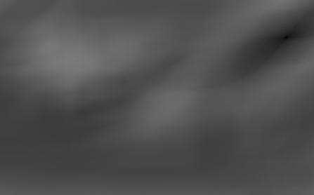

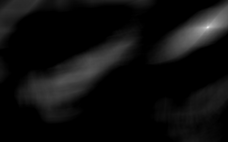

Note that for ``sqdiff-normed``, the most likely location for the template
is indicated by the darkest pixel, whereas for ``ccorr-normed`` and
``ccoeff-normed`` the brightest pixel indicates the most likely position.

The heat map contains a pixel for every possible location of the template
withing the source image. Mathematically, this equates to::

    R[w,h] = ((S[w] - T[w] + 1), (S[h] - T[h] + 1))

where ``R``, ``S``, ``T`` are Result, Source, Template images respectively,
and ``w``, ``h`` are width and height. As such, comparing a template and source
of equal width and height results in a heat map of 1 pixel. The heat map is
named ``source_matchtemplate.png`` in the **stbt-debug** directory.

Once the heat map is produced, the map is searched for the minimum pixel value
(``SQDIFF``) or maximum pixel value (``CCORR``, ``CCOEFF``). This is then
compared to a defined threshold value, and if it exceeds the threshold value
then the second pass of the template match if performed, else the template
matching cycle begins anew (possibly with a new source frame when using video).

The threshold value is set by default to 0.8, but can be overwritten by setting
the ``match_threshold`` parameter. Note: a threshold of 0 (zero) will pass even
the most dissimilar of matches, whilst a threshold of 1 will likely never pass
anything, due in part to discrepancies with `floating point arithmetic`_. For
example, the highest first pass result obtained from the above matches was
0.9992421... despite the template being a cropped version of the source image.

To summarise:

+ **Match method**: which OpenCV template match to use.
+ **Match threshold**: the certainty of match required to perform confirm step,
  where 1.0 is absolute certainty and 0.0 is no certainty.

.. _floating point arithmetic: http://docs.python.org/2/tutorial/floatingpoint.html

Second Pass Confirmation and Associated Parameters
==================================================

The second pass acts as a confirmation of the match found in the first pass.
There are currently 2 different confirmation methods available, plus a third
option which lets you forgo the confirmation stage and assume the match as
positive ("none"). The other 2 methods are ``"absdiff"`` (the default) and
``"normed-absdiff"``. To overwrite
this, set the ``confirm_method`` parameter.

The ``"absdiff"`` and ``"normed-absdiff"`` methods are identical except for the addition
of one step in ``"normed-absdiff"``. They use the coordinates of the strongest match
found in the first pass to create a Region Of Interest (ROI) image cropped to
the same dimensions as the template. This can be found as ``source_roi.png`` under
**stbt-debug**.

To aid with demonstrating the second pass, I will use the following template,
which successfully gets through the first pass - which we can take to mean it's
at least a *close* match - but fails the second pass, as expected.

Then the both the ROI and a copy of the template are converted to grayscale,
and can be found as ``source_roi_gray.png`` and ``template_gray.png`` under
**stbt-debug** respectively.

.. table:: \

    =================== =================
    |rs-roi|            |rs-temp|
    **Source ROI**      **Template**
    |rs-roi-gray|       |rs-temp-gray|
    **Source ROI Gray** **Template Gray**
    =================== =================

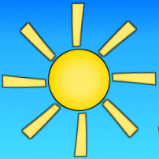

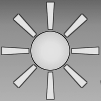

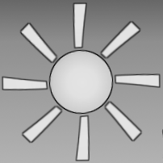

This is where the methods differ: at this point, when using the ``"normed-absdiff"``
method, the grayscaled ROI and template are normalized. This stretches the range
of brightness values of each image to cover the entire [0.0..1.0f] range
available.

The difference in this example isn't huge, but it is there.

.. table:: \

    ============================== ============================
    |rs-roi-gray-normed|           |rs-temp-gray-normed|
    **Source ROI Gray Normalized** **Template Gray Normalized**
    ============================== ============================

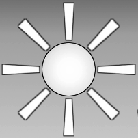

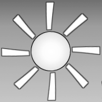

The filenames are ``source_roi_gray_normalized.png`` and
``template_gray_normalized.png`` respectively, however these images obviously
will onlu be present when using the ``"normed-absdiff"`` method. (This is a useful
way of debugging if you aren't getting an expected match.)

The next stage is to take the absolute difference between source and template
images. Each pixel of both source and template has a value between zero and one,
so when the absolute difference is performed, the greater the difference between
two corresponding pixels' values then the greater the value of the resulting
pixel. In other words, a big difference creates a pixel closer to white, and
vice versa.

Here's what the absolute difference (``absdiff.png``) of our current example
looks like.

.. table:: \

    ======================= =======================
    |rs-absdiff-normed|     **Absolute Difference**
    ======================= =======================

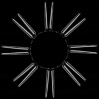

Important to note at this point is that the above image was produced using
the ``"normed-absdiff"`` confirm method. Here is the equivalent when using ``"absdiff"``.

.. table:: \

    ============ ==============================================================
    |rs-absdiff| **Absolute Difference (source and template *not* normalized)**
    ============ ==============================================================

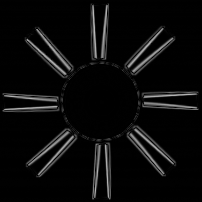

As before, the effect of the normalize is not huge in this example, however it
does affect the next step.

If we could guarantee that our video stream would always be free of noise and
other impefections, we could at this point say, "If the absolute difference
produces an image that is completely black, then we have a match, and if it's
not completely black then we don't have a match." However, we cannot usually
guarantee this, even if if we are trying to match a template which was cropped
from the same source we are trying to match it too. For example:

.. table:: \

    ============= =========================================
    |banner-temp| **Template cropped directly from source**
    ============= =========================================

does *not* match the source with a ``confirm_threshold`` of 0.005 because of the
slight noise created by passing the source image through gstreamer. This is
the resultant ``absdiff.png``:

.. table:: \

    =========================== =====================================================
    |banner-low-thresh-absdiff| **Absolute Difference (confirm_threshold = 0.005)**
    =========================== =====================================================

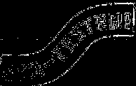

So let's explain what ``confirm_threshold`` is doing, as this is what controls
the stage after the absolute difference is performed. Thresholding a grayscale
image results in an image that is purely black and white (no intermediates).
All pixels which have a value below the given threshold become black, whilst all
those above become white. As such, increasing the ``confirm_threshold`` makes the
match less sensitive to noise and other differences between source and template;
while decreasing it, as with the example above, makes the match more sensitive
to noise.

There are two more important things to note about the confirm threshold. Unlike
the match threshold in the first pass, the confirm threshold will likely have
to be configured differently depending on which confirm method is being used.
``"normed-absdiff"`` has the advantage of stretching the luminance range, and
therefore accentuate any differences between source and template when they are
absolute differenced. This has the effect of meaning that there will likely be
a greater luminance range in ``absdiff.png``, which means a greater confirm
threshold will be needed than the same match using ``"absdiff"`` in order for all
the should-matches to still pass successfully.

The second import thing to note is that although the ``confirm_threshold`` is
specified as a floating point number - and therefore can be though of as the
equivalent, that is to say, a confirm threshold of 0.5 means "match with an
accuracy of 50% leeway - because the grayscale image has a depth of 8 bits, the
pixel values fall in the range [0..255u], and so the floating point confirm
threshold value must be transformed to an 8 bit unsigned value. Basically all
this means is that there is an accuracy limit on the confirm threshold value
due to rounding. The minimum variance between two confirm threshold values is
1/255, or 0.003921569. Consequently, there is not  much advantage to being more
accurate than +/- 0.005, although feel free to do the conversion to calculate
the exact values if you want.

Here is the thresholded absolute difference (``absdiff_threshold.png``) from our
original example, using the default settings once again.

.. table:: \

    =================== ===================================
    |rs-absdiff-thresh| **Thresholded Absolute Difference**
    =================== ===================================

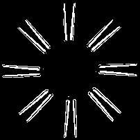

The next stage is eroding the thresholded image. What this does is remove a
certain amount of the white pixels which resulted from the threshold, due
to noise, etc. Only white pixels which have an immediately adjacent black pixel
are eroded (made black). The parameter ``erode_passes`` dictates the number of
times to perform the erode step, with 0 (zero) effectively meaning don't do
the erode pass. Only the final image after all the erodes are performed is
stored as ``absdiff_threshold_erode.png``. Here's the result of the erode step
on our example (``erode_passes`` = 1).

.. table:: \

    ========================= ==========================================
    |rs-absdiff-thresh-erode| **Thresholded Absolute Difference Eroded**
    ========================= ==========================================

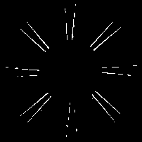

The threshold and the erode might seem to do similar things: they do, however
the erodes are much more aggressive and less fine-tunable than changing the
threshold. A good practice is to change the ``confirm_threshold`` to account for
incidental noise and small variations, and to use more than one erode pass
if you are trying to match a template which is *known* to be different to the
source. See the `Confirm Threshold VS Erode Passes`_ section. Another
example of this could be if you are trying to match a generic template to a
button where you want to ignore the text label on the button.
Here's the effect of two erode passes on with our example.

.. table:: \

    =========================== ===============================================================
    |rs-absdiff-thresh-2-erode| **Thresholded Absolute Difference Eroded (erode_passes = 2)**
    =========================== ===============================================================

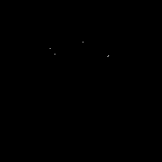

The final step is to count the number of white pixels which remain. There must
be no white pixels remaining for the match to be deemed positive. Our above
example, even with two erode passes, does not meet this criteria, though it
would if we increased it to three erode passes.

To summarise:

+ **Confirm method**: which confirm method to use.
+ **Confirm threshold**: the leniancy for taking noise and slight variation into
  account, where 0.0 is no leniancy and 1.0 is complete leniancy.
+ **Erode passes**: how many times to erode the ``absdiff_threshold.png`` image.

Confirm Threshold VS Erode Passes
=================================

Let's see an example of where an increased number of ``erode_passes`` can be too
strong and lead to a false positive match. We'll use a version of our source
frame which has had noise added to it, and try to match the rabbit.

.. table:: \

    ====================== ===================
    |noisy-source|         |bunny-template|
    **Noisy Source Frame** **Rabbit Template**
    ====================== ===================

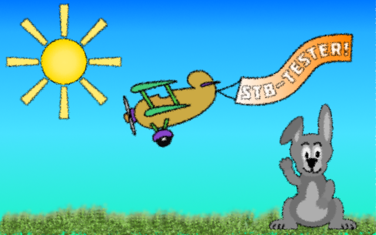

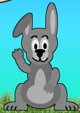

We can account for this noisy and get the match we watch either by increasing
the confirm threshold from 0.28 to 0.31, or by increasing the number of erode
passes from 1 to 2. However, imagine our source frame is a UI, and the rabbit is
a button which when highlighted gets a thicker border, as such

.. table:: \

    ================================= ===================================================
    |noisy-thick-border-bunny-source| **Rabbit "button" highlighted with thicker border**
    ================================= ===================================================

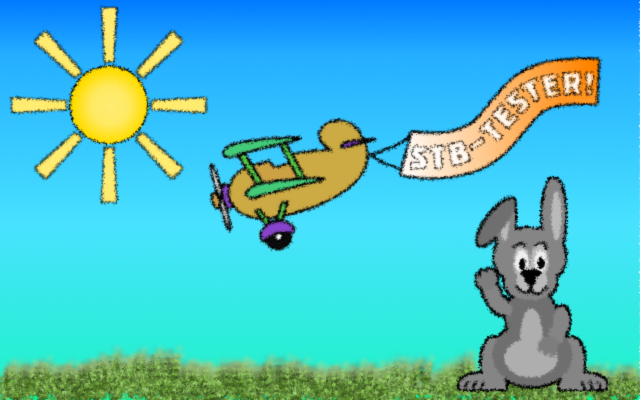

This will only match with a confirm threshold of 0.54 - which is safely above
what is required to pass the noisy frame - so we won't get a false positive.
But it *will* match with 2 erode passes - the same as the noisy frame - which
could lead to a false positive.

<!-- End reStructuredText content -->

  This article copyright © 2013 <a href="http://www.youview.com">YouView TV
  Ltd</a>. 
  Licensed under a <a rel="license"
  href="http://creativecommons.org/licenses/by-sa/3.0/">Creative Commons
  Attribution-ShareAlike 3.0 Unported license</a>.

</body>
</html>
