<!DOCTYPE html>
<html lang="en">
<head>
  <meta charset="utf-8" />
  <title>stb-tester image matching parameters</title>
  <link href="stb-tester.css" media="all" rel="stylesheet" type="text/css" />

  

</head>

<body id="templatematch">

  <h1>stb-tester image matching parameters</h1>
  

    By <a href="http://lewishaley.co.uk">Lewis Haley</a>.
    Last updated @UPDATED@.
  

%(body)s

<!-- Begin reStructuredText content -->

Since **stb-tester** 0.13, the previously hard-coded parameters for stbt's
template matching algorithm have been exposed to allow the user to customise
them either via a global configuration or on a per-match basis. This article
will attempt to explain the effects of the various parameters and why you might
want to change them.

.. image:: match-parameters-graphic.png

For demonstration, we shall be using the following template image (which is
lifted from the YouView UI) and two source frames: one which we expect to match
the template to, and one which we expect to not match the template to (but
**does match**).

+--------------------+-------------------------+----------------------------+
|     |template|     |      |true-source|      |       |false-source|       |
+--------------------+-------------------------+----------------------------+
| **Template image** | **Expect match source** | **Expect no-match source** |
+--------------------+-------------------------+----------------------------+

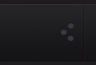
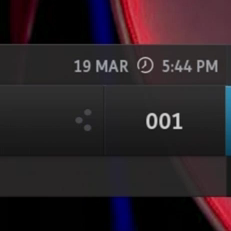
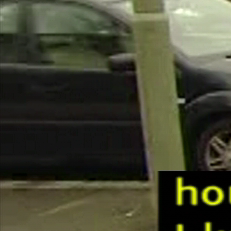

To see the intermediate steps of the template matching process, you can run
stbt in "extra verbose" mode which will save out copies of the intermediate
images. To do this, run ``stbt run -vv`` or ``stbt templatematch -v``
(``stbt templatematch`` runs with regular debug output automatically). This
will create a directory called **stbt-debug**, which in turn contains
**templamatch** and **motiondetect** directories. The contents of
**stbt-debug/templatematch** will be the most recent match performed,
regardless of success or failure (so make copies of the images if you don't
want to lose them!).

The following table shows the debug images created as a result of running the
following command:

::

    stbt templatematch -v match-parameters-true-source.png \
        match-parameters-template.png

|

+------------------------+-----------------------------------------------------+
| |template|             | **template.png**, **source.png**                    |
| |true-source|          |                                                     |
+------------------------+-----------------------------------------------------+
| |true-matchtemplate|   | **source_matchtemplate.png**                        |
|                        |                                                     |
|                        | This image is the result of running OpenCV's        |
|                        | ``matchTemplate`` function with the template and    |
|                        | source images as inputs. Each pixel it contains     |
|                        | indicates the relative strength-of-match of the     |
|                        | template against the source image at that pixel's   |
|                        | given position, and where the pixel's coordinates   |
|                        | are the coordinates of the template's top left      |
|                        | corner on the source image.                         |
|                        | Using ``match_method="sqdiff-normed"`` (default)    |
|                        | will give an image where the best match is          |
|                        | represented by the darkest pixel; for               |
|                        | ``"ccorr-normed"`` and ``"ccoeff-normed"``, the     |
|                        | brightest pixel is the best match.                  |
|                        | The value of the best matching pixel must be        |
|                        | greater than the ``match_threshold`` value for the  |
|                        | matching process to proceed further. By default     |
|                        | this is ``0.8``. Note than if                       |
|                        | ``match_method="sqdiff-normed"``, then the best     |
|                        | value is ``1 - <pixel_value>``. As such, the        |
|                        | greater the ``match_threshold``, the greater        |
|                        | certainty we have of the match at that location.    |
|                        | Note that, in practice, a perfect match of 1 is     |
|                        | never found because of how the ``matchTemplate``    |
|                        | function works.                                     |
+------------------------+-----------------------------------------------------+
| |true-source_roi|      | **source_roi.png**, **source_roi_gray.png**,        |
| |true-source_roi_gray| | **template_gray.png**                               |
| |template_gray|        |                                                     |
|                        | Although the previous step gives us a *fairly* good |
|                        | idea of whether we have found a match, it is not    |
|                        | 100% reliable because sometimes it can report a     |
|                        | strong match value between a template and source    |
|                        | which *should not* match. Because of this, we do a  |
|                        | second "confirmation" match of the template, but    |
|                        | this time only against the area of the image which  |
|                        | the previous step thinks is where the match is      |
|                        | located. This is called the *region of interest*,   |
|                        | or *ROI* for short. This second pass uses           |
|                        | grayscaled versions of the template and source-roi  |
|                        | images. Note that these and all subsequent images   |
|                        | are only created if the match gets through the      |
|                        | first pass.                                         |
+------------------------+-----------------------------------------------------+
| |true-absdiff|         | **absdiff.png**                                     |
|                        |                                                     |
|                        | A match between the grayscaled template and         |
|                        | source-roi is determined by calculating the         |
|                        | *Absolute Difference* between their corresponding   |
|                        | pixels. In the resultant image, the brighter the    |
|                        | pixel, the greater the difference between the       |
|                        | template and source at that point.                  |
|                        | There are 3 ``confirm_methods``: ``"none"``,        |
|                        | ``"absdiff"`` and ``"normed-absdiff"``.             |
|                        | ``"absdiff"`` is default. ``"none"`` means, don't   |
|                        | perform the confirmation step, just return a        |
|                        | positive match result. An example of using          |
|                        | ``"normed-absdiff"`` is given later in this article |
|                        | and explains the additional debug images that come  |
|                        | with this method.                                   |
+------------------------+-----------------------------------------------------+
| |true-threshold|       | **absdiff_threshold.png**                           |
|                        |                                                     |
|                        | The "absdiff" image is thresholded, which means     |
|                        | that all pixels below a certain value become black, |
|                        | and the rest become white. The                      |
|                        | ``confirm_threshold`` parameter controls the        |
|                        | dividing point for the threshold operation. A       |
|                        | smaller value means there is less leniency for      |
|                        | difference (e.g. noise, gamma variation,            |
|                        | antialiased text) whilst a greater value means that |
|                        | more difference is ignored. A value of 1  will      |
|                        | return a positive match everytime.                  |
+------------------------+-----------------------------------------------------+
| |true-erode|           | **absdiff_threshold_erode.png**                     |
|                        |                                                     |
|                        | At the very end of the matching process, we analyse |
|                        | the resulting black and white binary image for any  |
|                        | white pixels. If we find *any* white pixels, then   |
|                        | a negative match is reported. Before this though,   |
|                        | we perform an erode pass over the image. This       |
|                        | removes the outer layer of white pixels from any    |
|                        | area of the image where there is a white pixel.     |
|                        | (Imagine a 3x3 square of white pixels. The erode    |
|                        | pass removes the outer layer, leaving the one       |
|                        | remaining central white pixel.) The                 |
|                        | ``erode_passes`` parameter controls the number of   |
|                        | times the erode pass is performed. By default, this |
|                        | value is 1 to account for incidental noise that is  |
|                        | often present. Note that increasing the number of   |
|                        | ``erode_passes`` is a lot more destructive than     |
|                        | increasing the ``confirm_threshold``. Ideally this  |
|                        | value should be zero.                               |
|                        | Note that this example matches well enough that     |
|                        | there are no white pixels remaining to be eroded.   |
|                        | Please see the example using                        |
|                        | ``confirm_method="normed-absdiff"``.                |
+------------------------+-----------------------------------------------------+

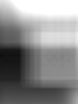
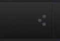
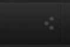
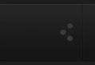
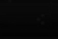
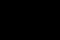

Here are the debug images from a source where we *expect a negative match*, but
where we in fact get a *false positive match*.

+------------------------+-----------------------------------------------------+
| |template|             | **template.png**, **source.png**                    |
| |false-source|         |                                                     |
+------------------------+-----------------------------------------------------+
| |false-matchtemplate|  | **source_matchtemplate.png**                        |
|                        |                                                     |
|                        | Note that the ``first_pass_result`` (see stbt's man |
|                        | page, under ``class MatchResult()``) is 0.83... for |
|                        | this match, which is just good enough to pass to    |
|                        | the confirmation step, whereas the previous example |
|                        | gave a strong ``first_pass_result`` of 0.95...      |
+------------------------+-----------------------------------------------------+
| |false-source_roi|     | **source_roi.png**, **source_roi_gray.png**,        |
| |false-src_roi_gray|   | **template_gray.png**                               |
| |template_gray|        |                                                     |
+------------------------+-----------------------------------------------------+
| |false-absdiff|        | **absdiff.png**                                     |
|                        |                                                     |
|                        | The absolute difference indicates there is a fair   |
|                        | amount of difference between template and source,   |
|                        | but...                                              |
+------------------------+-----------------------------------------------------+
| |false-threshold|      | **absdiff_threshold.png**                           |
|                        |                                                     |
|                        | ...once thresholded we see that none of the pixels  |
|                        | exceeded the ``confirm_threshold`` value...         |
+------------------------+-----------------------------------------------------+
| |false-erode|          |  **absdiff_threshold_erode.png**                    |
|                        |                                                     |
|                        | ...and once again, despite the obvious difference   |
|                        | between template and source to the human eye, the   |
|                        | erode step has nothing to do, and this match goes   |
|                        | on to return a (false) positive result.             |
+------------------------+-----------------------------------------------------+

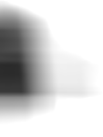
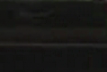
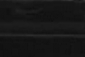
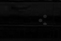
.. |false-threshold| image:: match-parameters-false-absdiff_threshold.png
.. |false-erode| image:: match-parameters-false-absdiff_threshold_erode.png

Here is the same match, but this time running the command as

::

    stbt templatematch -v match-parameters-false-source.png \
        match-parameters-template.png confirm_method="normed-absdiff"

|

+------------------------+-----------------------------------------------------+
| |normed-src_roi_gray|  | **source_roi_gray_normalized.png**,                 |
| |normed-template_gray| | **template_gray_normalized.png**                    |
|                        |                                                     |
|                        | When using ``confirm_method="normed-absdiff"``, the |
|                        | template and the source image are normalized prior  |
|                        | to the absolute difference being calculated. This   |
|                        | helps to exaggerate differences when the template   |
|                        | and source images have small, similar ranges of     |
|                        | pixel brightness, as the ranges are transformed to  |
|                        | occupy the maximum range of [0..255].               |
+------------------------+-----------------------------------------------------+
| |normed-absdiff|       | **absdiff.png**                                     | 
|                        |                                                     |
|                        | This time, we see a significant amount of           |
|                        | difference arise from the absolute difference       |
|                        | operation...                                        |
+------------------------+-----------------------------------------------------+
| |normed-threshold|     | **absdiff_threshold.png**                           |
|                        |                                                     |
|                        | ... and after being thresholded, there *are* pixels |
|                        | which exceeded the ``confirm_threshold`` value,     |
|                        | and so there are white artifacts remaining...       |
+------------------------+-----------------------------------------------------+
| |normed-erode|         | **absdiff_threshold_erode.png**                     |
|                        |                                                     |
|                        | ... which even after being eroded, persist, meaning |
|                        | that the result is accurately reported as a negtive |
|                        | match.                                              |
+------------------------+-----------------------------------------------------+

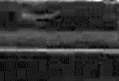
.. |normed-template_gray| image:: match-parameters-normed-absdiff-template_gray_normalized.png
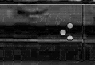
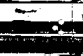

<!-- End reStructuredText content -->

  This article copyright © 2013 <a href="http://www.youview.com">YouView TV
  Ltd</a>. 
  Licensed under a <a rel="license"
  href="http://creativecommons.org/licenses/by-sa/3.0/">Creative Commons
  Attribution-ShareAlike 3.0 Unported license</a>.

</body>
</html>
